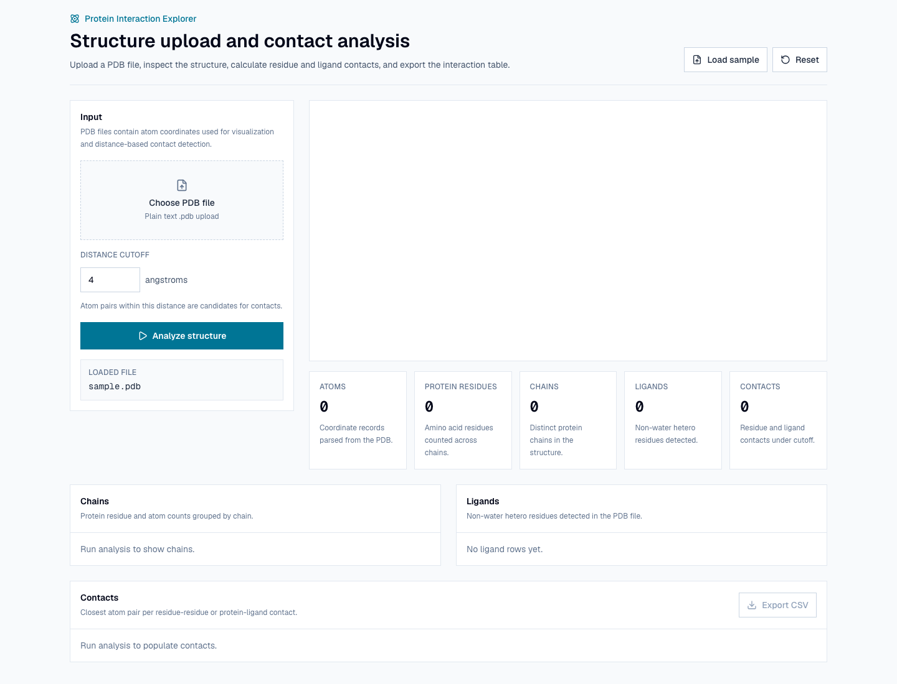
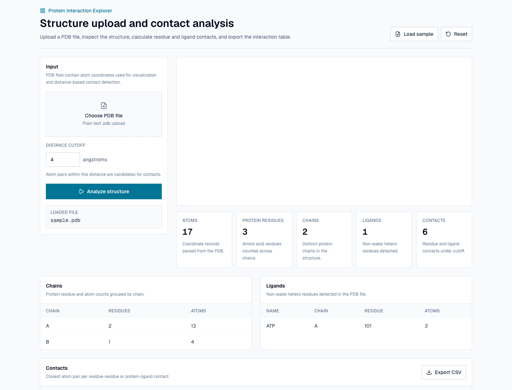
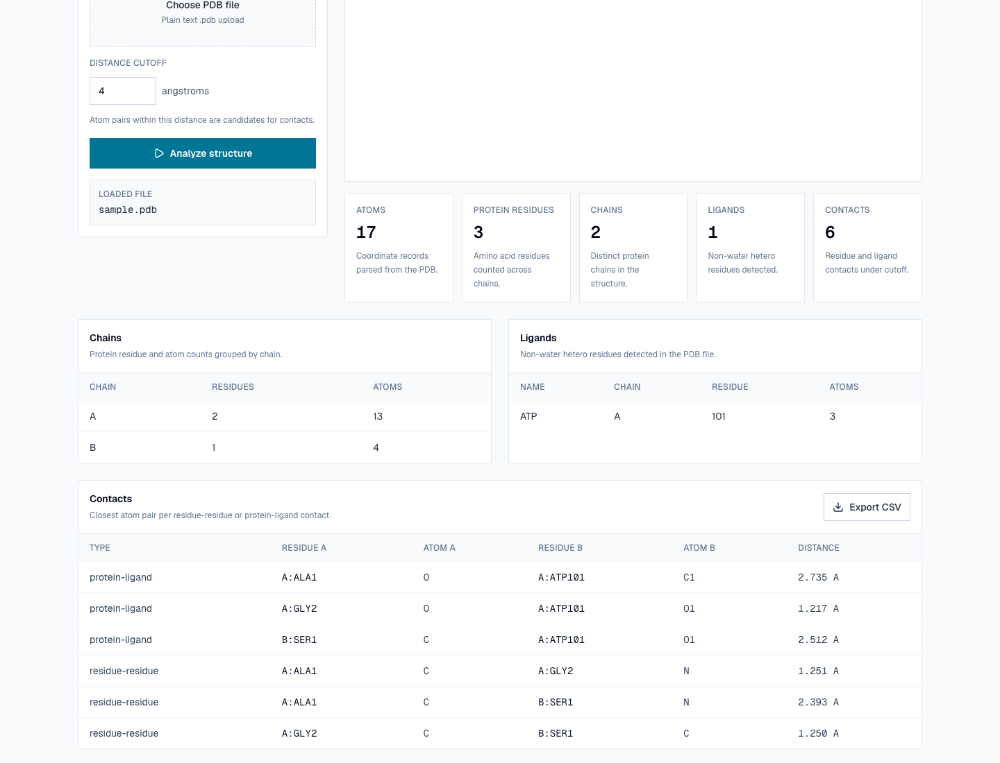

# Protein Interaction Explorer

Protein Interaction Explorer is an open-source structural biology workspace for uploading, fetching, visualizing, analyzing, and reporting protein structures. The MVP lets a scientist upload a PDB or mmCIF file, fetch a PDB ID from RCSB, visualize the structure, parse chains/residues/ligands, calculate categorized contacts, summarize interaction participants, and export a clean interaction report.

The project is intentionally simple for the public MVP: no authentication, no database, no Docker, no queues, and no cloud storage.

## MVP Features

- Upload a local PDB or mmCIF file.
- Fetch a deposited structure by PDB ID from RCSB.
- Parse atoms, residues, chains, and ligands.
- Summarize chain counts, residue counts, ligand records, and atom counts.
- Calculate residue-residue contacts.
- Calculate protein-ligand contacts when ligands are present.
- Categorize contacts as protein-protein, protein-ligand, protein-water, ligand-water, intra-chain, inter-chain, or possible clash.
- Summarize top contacting residues, top contacting ligands, closest contacts, and category counts.
- Detect AlphaFold-style pLDDT confidence values from predicted-structure uploads.
- Ignore hydrogen atoms during contact detection.
- Use Gemmi NeighborSearch for contact search.
- Return warnings for useful analysis context.
- Expose a FastAPI backend with health and analysis endpoints.
- Upload PDB/mmCIF files or load a sample PDB in the frontend.
- Fetch RCSB mmCIF structures from a PDB ID.
- Render structures with 3Dmol.js.
- Show RCSB metadata, confidence summaries, interaction summaries, summary cards, chain table, ligand table, and contact table.
- Filter the contact table by contact category.
- Export contacts as CSV.
- Prepare frontend API calls through `NEXT_PUBLIC_API_URL`.

## Tech Stack

Frontend:

- Next.js
- TypeScript
- Tailwind CSS
- 3Dmol.js
- Vercel

Backend:

- FastAPI
- Python
- Gemmi
- Pydantic
- pytest
- Render

## Repo Structure

```text
protein-interaction-explorer/
  README.md
  render.yaml
  frontend/
    .env.example
    src/lib/api.ts
  backend/
    requirements.txt
    pyproject.toml
    app/
      main.py
      routes.py
      service.py
      models.py
      parser.py
      contacts.py
      contact_classification.py
      csv_export.py
    tests/
  examples/
    sample.pdb
    sample.cif
  docs/
```

## Local Development

Backend:

```bash
cd /Users/cankarakoc/Codex/protein-interaction-explorer
python3 -m venv .venv
.venv/bin/pip install -e 'backend[dev]'
.venv/bin/uvicorn app.main:app --reload --app-dir backend --port 8000
```

Health check:

```bash
curl http://localhost:8000/health
```

Expected:

```json
{"status":"ok"}
```

Frontend:

```bash
cd /Users/cankarakoc/Codex/protein-interaction-explorer/frontend
cp .env.example .env.local
npm install
npm run dev
```

Local frontend API variable:

```text
NEXT_PUBLIC_API_URL=http://localhost:8000
```

Open:

```text
http://localhost:3000
```

## Backend Tests

```bash
cd /Users/cankarakoc/Codex/protein-interaction-explorer
.venv/bin/pytest backend/tests
```

The tests cover PDB and mmCIF parser behavior, ligand detection, contact calculation, contact classification, interaction summaries, neighbor search, RCSB PDB ID validation, route behavior, CORS origin parsing, and bad upload handling.

## API

Health:

```text
GET /health
```

Analyze:

```text
POST /analyze
POST /api/analyze
GET /api/rcsb/{pdb_id}/analyze
```

The analysis endpoint accepts a multipart PDB, `.cif`, or `.mmcif` upload and an optional `cutoff_angstrom` form value.
The RCSB endpoint accepts a 4-character PDB ID and optional `cutoff_angstrom` query value, fetches mmCIF coordinates, and returns fetched structure text plus analysis results. Removed or superseded entries can still be analyzed when coordinates are available; metadata marks them as `removed` and includes replacement IDs, for example `1HHB` replaced by `2HHB`, `3HHB`, and `4HHB`.

Response shape:

```json
{
  "version": "0.1.0",
  "summary": {
    "atom_count": 0,
    "residue_count": 0,
    "chain_count": 0,
    "ligand_count": 0,
    "contact_count": 0
  },
  "metadata": null,
  "confidence": null,
  "interaction_summary": null,
  "residue_confidences": [],
  "chains": [],
  "ligands": [],
  "contacts": [],
  "warnings": []
}
```

RCSB response shape:

```json
{
  "filename": "4HHB.cif",
  "structure_format": "cif",
  "structure_text": "data_...",
  "analysis": {
    "version": "0.1.0",
    "summary": {},
    "metadata": {
      "source": "rcsb",
      "status": "current",
      "pdb_id": "4HHB",
      "replaced_by": []
    },
    "confidence": null,
    "interaction_summary": null,
    "residue_confidences": [],
    "chains": [],
    "ligands": [],
    "contacts": [],
    "warnings": []
  }
}
```

## Deployment

Frontend target: Vercel.

Frontend environment variable:

```text
NEXT_PUBLIC_API_URL=https://your-render-backend.onrender.com
```

Backend target: Render.

Render settings:

```text
Root Directory: backend
Build Command: pip install -r requirements.txt
Start Command: uvicorn app.main:app --host 0.0.0.0 --port $PORT
Health Check Path: /health
```

Backend environment variable:

```text
FRONTEND_ORIGIN=https://your-vercel-app.vercel.app
```

See [docs/DEPLOYMENT.md](docs/DEPLOYMENT.md).

## Roadmap

- v0.1 MVP launch: PDB/mmCIF upload, visualization, backend analysis, CSV export, Vercel + Render deployment.
- v0.2 public demo polish: better sample workflow, UI states, screenshots, demo docs.
- v0.3 scientific credibility: richer biology explanations, validation, chain/ligand highlighting.
- v0.4 database-connected version: saved reports and shareable URLs.
- v0.5 AI-structure support: AlphaFold, ColabFold, Boltz, OpenFold-style outputs and confidence panels.

See [docs/RELEASE_PLAN.md](docs/RELEASE_PLAN.md) and [docs/ROADMAP.md](docs/ROADMAP.md).

## Screenshots

Sample loaded in the deployed app:



Sample analysis results:



Contact table:



## Documentation

- [Action Plan](docs/ACTION_PLAN.md)
- [Architecture](docs/architecture.md)
- [Biology Notes](docs/biology_notes.md)
- [Deployment](docs/DEPLOYMENT.md)
- [Git Workflow](docs/GIT_WORKFLOW.md)
- [Manual QA Checklist](docs/MANUAL_QA.md)
- [MVP Scope](docs/MVP_SCOPE.md)
- [Decisions](docs/DECISIONS.md)
- [Performance Baseline](docs/PERFORMANCE_BASELINE.md)
- [Product Direction](docs/PRODUCT_DIRECTION.md)
- [Release Plan](docs/RELEASE_PLAN.md)
